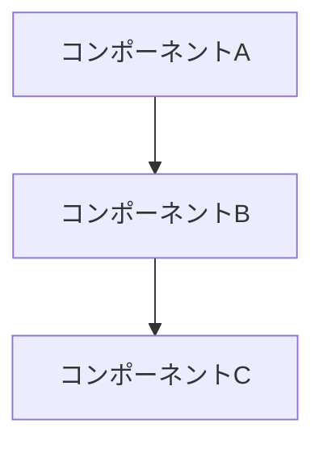

# システムパターン

## アーキテクチャ概要
[システムの全体的なアーキテクチャを記述]

## 設計パターン
- [パターン1]: [使用箇所と理由]
- [パターン2]: [使用箇所と理由]

## コンポーネント関係

## 重要な技術的決定
| 決定事項 | 理由 | 日付 |
|---------|------|------|
| [決定1] | [理由] | [日付] |

## 命名規約
- [規約1]
- [規約2]

## エラーハンドリングパターン
- [パターンの説明]

## データフローパターン
- [パターンの説明]
